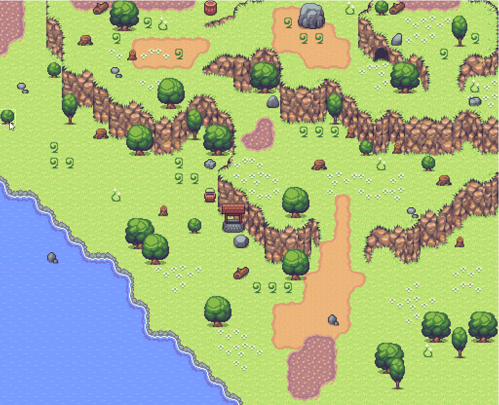
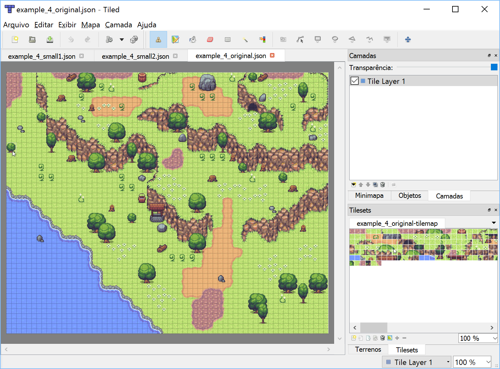

# image2tiled
Tool that creates a tiled map based on an image that describes a built map.

## Examples

Using an image like this as input

<h3 align="center">
  
</h3>

This tool will generate this Tiled map.

<h3 align="center">
  
</h3>

## Usage

`$ image2tiled --tile-size 16 map.png`

Alternatively
`$ python -m image2tiled --tile-size 16 map.png`

## Installation

`pip install image2tiled`

## Credits

Images by George Bailey, from [16x16 Game Assets](http://opengameart.org/content/16x16-game-assets)